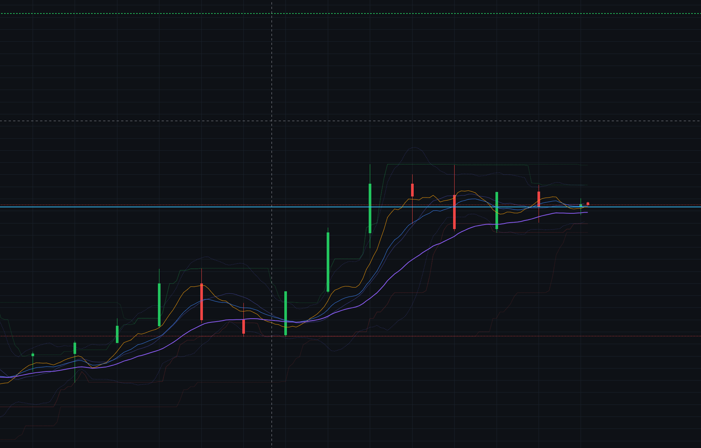

# Trading Agent

A real-time desktop trading assistant built with **Electron** that runs 9 strategies against live market data, draws indicator overlays and entry signals directly on the chart, and paper-trades every decision so you can see how it performs — all without risking a cent.



---

## Features

- **9 built-in strategies** — Trend (EMA ribbon + ADX), Momentum (MACD + RSI + Stochastic), Turtle Breakout (Donchian 20/55), Mean Reversion (Bollinger + RSI), Ichimoku Cloud, VWAP + Volume, Support/Resistance + Fibonacci, Price Action, and a Confluence mode that blends all of them
- **Live chart overlays** — EMA 9/21/50, Bollinger Bands, and Donchian 20/55 channels drawn directly on the candlestick chart
- **Entry/exit markers with strategy labels** — Every signal shows which strategy triggered it (e.g. `SIGNAL LONG [TREND]`)
- **SL / TP / ENTRY lines** — Horizontal price lines with R-multiple labels, auto-computed per strategy
- **Paper trading engine** — Risk-% position sizing, leverage cap, commission, live open P&L, equity curve, win rate, profit factor, max drawdown
- **Instant signal recompute** — Runs on the live forming bar every 300ms, so SL/TP fire the moment price touches them
- **Multi-source live prices** — MetaTrader 5 broker feed → biquote.io (gold/forex) → TradingView → Binance WebSocket (crypto) → Yahoo Finance → Alpha Vantage
- **News sentiment** — RSS from Yahoo Finance, CoinDesk, CoinTelegraph, Reddit; lexicon-based scorer with negation awareness
- **Single merged chart view** — Lightweight-charts with candlesticks, indicator overlays, deal markers, and SL/TP/ENTRY price lines all in one view

> Research/education tool. It does not place real orders. Signals are deterministic rule output,
> not financial advice. Live market data may be delayed.

### Buy the app

Download the Windows installer: **[Buy Trading Agent on Gumroad — $19](https://zezorash.gumroad.com/l/vzkayw)**

---

## What it does

| Layer | What happens |
|-------|--------------|
| **Chart** | Loads the official TradingView advanced-chart widget inside a `<webview>`. A guest preload reads the symbol from the widget URL and syncs it back to the panel. |
| **Market data** | Pulls OHLCV candles + last price through a priority chain: **MetaTrader 5** (your broker's real ticks, when the terminal is running) → **TradingView** live price (`OANDA:XAUUSD`, `FX:EURUSD`, `BINANCE:BTCUSDT`) → keyless **Binance** (crypto, and gold/forex spot proxies for candles) → keyless **Yahoo Finance** → **Alpha Vantage** (stocks, needs a free key). |
| **Indicators** | SMA/EMA, RSI, MACD, ATR, Bollinger, Stochastic, ADX, OBV, rolling VWAP, Donchian, Ichimoku, Williams %R, CCI, MFI, pivots, Fibonacci, swing levels — all computed locally in `src/indicators.js`. |
| **Strategies** | 9 strategies (`trend_ema`, `breakout_donchian`, `momentum`, `meanrev_bollinger`, `ichimoku`, `vwap_volume`, `sr_fib`, `price_action`, `confluence`) in `src/strategies.js`, each with its own entry/SL/TP logic and a market-regime read. |
| **News** | Keyless RSS by default: Yahoo Finance per-ticker feed, CoinDesk + CoinTelegraph (crypto), Reddit RSS search. Optional Finnhub / NewsAPI with keys. |
| **Sentiment** | Lexicon + negation/look-ahead aware scorer (`src/sentiment.js`), weighted by engagement and recency, aggregated to a −100…+100 score. |
| **Signal** | Weighted composite of trend, momentum, volume, price action and news sentiment → **STRONG BUY / BUY / NEUTRAL / SELL / STRONG SELL** with score, reasons, and a plain-language entry plan. |
| **Signal engine** | `src/signals.js` turns the analysis + your open position into a live **ENTRY / HOLD / EXIT** decision, with break-even-at-R, stop/target hits, and exit-on-flip. |
| **Signals chart** | The default chart view. Draws candles plus EMA 9/21/50, Bollinger Bands, Donchian 20/55 overlays, the **whole deal lifecycle**: entry arrows labelled with the triggering strategy, close markers with the R result and exit reason (TP / SL / FLIP / SYMBOL / MANUAL), and Entry / SL / TP / Last price lines with their R distances. Open deals show live lines; when flat it shows the pending plan. |
| **Paper trading** | `src/paper.js` simulates a funded account: risk-% position sizing, leverage cap, commission, live open P&L, equity curve, win rate, profit factor and max drawdown. Persisted to `paper-account.json`. |
| **Alerts** | Desktop notifications when the signal changes side and clears a score threshold. |

The overlay panel is **draggable** (grab its header), **collapsible** (the `–` button), and shows
buttons on the meter so you can see where the current score sits.

---

## Project layout

```
trading-agent/
├─ config.json              # all tunables (thresholds, weights, feeds, polling)
├─ electron/
│  ├─ main.js               # window, IPC handlers, notifications
│  ├─ preload.js            # exposes window.agent (IPC) + window.lib (analysis engine)
│  └─ news.js               # RSS/news fetching + aggregation (main process)
├─ bridge/
│  └─ mt5_bridge.py         # local MetaTrader 5 HTTP bridge (broker ticks + candles)
├─ src/
│  ├─ indicators.js         # SMA/EMA, RSI, MACD, ATR, Bollinger, Stoch, ADX, VWAP, Donchian, Ichimoku…
│  ├─ strategies.js         # 9 strategies + confluence, regime detection, strategy metadata
│  ├─ rules.js              # composite scoring + per-strategy entry/SL/TP plans
│  ├─ signals.js            # ENTRY/EXIT/HOLD engine (break-even, flip, manual exit)
│  ├─ paper.js              # paper-trading account: sizing, P&L, equity curve, stats
│  ├─ sentiment.js          # news sentiment lexicon + scoring
│  ├─ mt5.js                # MetaTrader 5 adapter (talks to bridge/mt5_bridge.py)
│  ├─ tradingview.js        # TradingView live-price adapter (scanner.tradingview.com)
│  ├─ market.js             # source router: MT5 + TradingView + Binance + Yahoo + Alpha Vantage
│  └─ webview-preload.js    # injected into the TradingView page, reads the widget URL symbol
└─ renderer/
   ├─ index.html            # layout: chart + top bar + floating overlay + tabs + settings modal
   ├─ styles.css            # dark theme
   ├─ app.js                # wire-up, polling, rendering
   └─ vendor/               # vendored lightweight-charts build (signals view)
```

---

## Setup

Requires **Node.js 18+**.

```bash
npm install
npm start
```

If Electron's binary wasn't downloaded automatically (e.g. install scripts blocked):

```bash
node node_modules/electron/install.js
```

### Optional: live MetaTrader 5 data

The app reads your broker's real XAUUSD / forex feed from a running **MT5 terminal** through a
small Python bridge. Without MT5 it still streams live prices from TradingView/Binance.

1. Install the [MetaTrader 5 terminal](https://www.metatrader5.com/en/download) and log in to
   your broker account (any account type; a demo account is fine).
2. Install the Python package once:

   ```bash
   py -3 -m pip install MetaTrader5
   ```

3. Start the app. It auto-spawns `bridge/mt5_bridge.py` and the badge next to **Last price**
   turns **`● MT5`** (purple) once connected. Bridge output is written to `_mt5.log`.

To run or debug the bridge by hand:

```bash
npm run mt5                 # or: py -3 bridge/mt5_bridge.py --port 8765
curl http://127.0.0.1:8765/health
```

If MT5 runs on another machine or a different port, set `market.mt5.bridgeUrl`. To attach to a
specific terminal/account, set `market.mt5.login` / `password` / `server` / `terminalPath` in
`config.json`.

The badge shows which feed is live:

| Badge | Meaning |
| --- | --- |
| `● MT5` | your MetaTrader 5 broker ticks (polled ~4×/s) |
| `● TV` | TradingView's own live price (`scanner.tradingview.com`) |
| `● STREAM` | Binance websocket, sub-second (crypto) |
| `● LIVE` | polled HTTP fallback (Yahoo) |
| `● RETRYING` | recent failures, backing off |

---

## Using it

1. Pick **Crypto**, **Stocks**, **Gold** or **Forex** in the top bar (defaults to **Gold / `XAUUSD`**).
2. Type a symbol and press **Enter**:
   - Crypto: `BTCUSDT`, `ETHUSDT`, `SOLUSDT` (auto-prefixed to `BINANCE:`).
   - Gold: `XAUUSD` (→ `OANDA:XAUUSD`).
   - Forex: `EURUSD`, `GBPUSD` (→ `FX:`).
   - Stocks: `AAPL`, `MSFT` (→ `NASDAQ:`).
   - You can also type an explicit exchange, e.g. `NYSE:BRK.B`, `BINANCE:ETHUSDT`.
3. Choose a **strategy** and a timeframe, then watch the overlay panel update.
4. The **Signals** chart (the default view) draws candlesticks with **EMA/Bollinger/Donchian overlays**, the whole deal lifecycle: entry arrows labelled with the triggering strategy (e.g. `SIGNAL LONG [TREND]`), close markers with the R result and exit reason, and Entry / SL / TP / Last price lines with their R distances. Switch to **TradingView** any time. Toggle the **News** / **Strategies** / **Account** / **Sources** tabs below.
5. Click **Settings** to tune thresholds, weights, strategies, signals, paper-trading and feeds.

### Reading the signal

- **Score** runs from −100 (max short) to +100 (max long). Cross it with the thresholds in
  `config.json` → `rules.thresholds`.
- **Entry plan** gives the direction, where to enter, and the strategy-specific stop-loss /
  take-profit. SL is always on the losing side of entry.
- **Why** lists the contribution of each factor so the score isn't a black box.
- The **deal card** shows the live ENTRY / HOLD / EXIT decision for the open trade, and the
  **Account** tab shows paper equity, open P&L, an equity curve and closed-trade history.

### Instant signals

The signal is recomputed against the **live, still-forming candle** — not just closed bars — every
`poll.analysisMs` (default 300 ms). Every tick therefore:

1. updates the live bar (open/high/low/close) and the LAST line;
2. re-runs the 9 strategies on that live bar → the score, entry plan and ENTRY/HOLD/EXIT
   decision move with the market;
3. checks the open deal against the live bar's high/low, so **SL/TP and flips fire the moment
   price touches them**, and new entries fill at the live market price.

So entries/exits are effectively at-market, at tick speed (≈4/s on MT5, sub-second on the Binance
websocket). Raise `poll.analysisMs` if you want a calmer signal, lower it for more reactivity.

---

## Configuration (`config.json`)

Key sections:

- `market` – default symbol/interval (gold / `XAUUSD`), the TradingView symbol prefix, data API
  base URLs, plus the live-source settings:
  - `mt5.enabled` / `mt5.autostart` – use the MetaTrader 5 bridge (auto-spawned on launch).
  - `mt5.login`, `mt5.password`, `mt5.server`, `mt5.terminalPath` – optional MT5 login details; leave
    `null` to attach to whatever terminal is already open.
  - `mt5.markets` – which markets MT5 should serve (default `["gold", "forex", "index"]`).
  - `tradingviewPrice` – use TradingView's own live price for gold/forex when MT5 isn't available.
  - `useBinanceProxies` + `binanceProxies` – map gold/forex symbols onto live Binance markets
    (`PAXGUSDT` / `EURUSDT`) for 24/7 candle history.
- `chart` – TradingView widget options and `defaultView` (`signals` or `tv`).
- `poll` – `tickMs` (live price tick, default 1s), `priceMs` (candle refresh), `recomputeMs`
  (full strategy recompute), `maxTickBackoffMs` (retry cap if the feed errors).
- `rules` – indicator periods, thresholds, ATR multipliers, factor weights, `strategy` (which
  strategy to run; `confluence` blends all of them) and `strategyWeights`.
- `signals` – `minEntryScore`, `exitOnFlip`, `flipScore`, `breakEvenAfterR`, `useBarExtremes`
  (`true` = evaluate the live bar's high/low, so SL/TP trigger on the tick, not at bar close).
- `poll` – `tickMs` (HTTP price poll), `mt5Ms` (MT5 poll, default 250), `analysisMs` (signal
  recompute, default 300), `recomputeMs` (analysis interval), `priceMs` (candle refresh),
  `maxTickBackoffMs`.
- `paper` – `enabled`, `autoTrade`, `initialBalance`, `currency`, `riskPerTradePct`, `leverage`,
  `commissionPerTrade`, `armDelayMs` (settle time after a symbol/interval switch before trading).
- `news` – enable/disable, refresh cadence, history window, subreddits, RSS feeds, API keys.
- `alerts` – desktop notification toggle and minimum |score| to notify.

Optional API keys can also come from the environment:

```
FINNHUB_KEY=...      ALPHAVANTAGE_KEY=...      NEWSAPI_KEY=...
```

Set them in Settings (persisted to `config.json`) or as env vars.

---

## Notes & limitations

- TradingView's own symbol picker is enabled; the preload reports the symbol it can read
  back to the panel. The widget URL's symbol is treated as authoritative so a stale/partial
  chart header can't spoof a symbol; set the symbol in the top bar to be certain.
- Paper trading is simulated against the app's own price feed and fills at the signal price —
  it ignores spread, slippage and real liquidity, so treat the stats as indicative only.
- The signal recompute runs on the live forming bar at `poll.analysisMs`; a very low value makes
  the score twitchy around the entry threshold, which can open/close paper trades often. 250–500 ms
  is a good balance.
- Gold/forex use TradingView's live price when MT5 isn't connected, so the numbers line up with
  tradingview.com. Candle history for gold comes from the 24/7 spot proxy (`PAXGUSDT`), which can
  differ from spot by a fraction of a percent.
- Reddit's RSS endpoint rate-limits aggressively from datacenter IPs; the app degrades
  gracefully (Yahoo/CoinDesk feeds still work) and reports provider errors in the **Sources** tab.
- Alpha Vantage's free tier is rate-limited; use it sparingly for stock symbols.
- There are no automated tests yet; `npm run check` performs syntax validation of every module.
